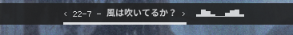
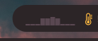

Simple [CAVA](https://github.com/karlstav/cava) (music visualization) module for [polybar](https://github.com/polybar/polybar). Download `cava.sh` and put it on your config or module folder.

<details>
    <summary>Screenshot</summary>
    
</details>

<details>
    <summary>Aimated GIF</summary>
    
</details>

Dependencies:
- CAVA
- polybar
- font that support unicode U+2581 to U+2588 (▁▂▃▄▅▆▇█). Most [unicode fonts](https://en.wikipedia.org/wiki/Unicode_font) should support these characters

On your polybar config, add these lines
```ini
[module/cava]
type = custom/script
tail = true
exec = $HOME/.config/polybar/cava.sh
format = <label>
format-font = 5
label = %output%
```

change `exec` value to where you put `cava.sh`.

You can change the number of bar by modifying the cava config section in `cava.sh`.
```
[general]
bars = 10
```

You can also modify the label foreground like this
```
[module/cava]
label-foreground = #594751
```
<details>
    <summary>Color changed</summary>
    
</details>

## Usability in other status-bar application
The script `cava.sh` can be used in another status-bar app like Waybar. In theory, any app that can display unicode characters can use the script.
`cava.sh` is a standalone script that does not require polybar and just outputting text (unicode). You can even try running it directly in the terminal to see the output.
